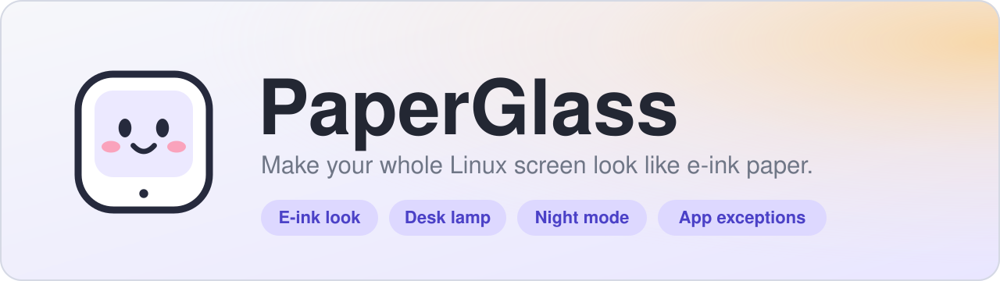

<p align="center">
  
</p>

<p align="center">
  <a href="../../releases/latest"></a>
</p>

<p align="center">
  
  
  
  
  
  
</p>

**PaperGlass** turns your whole screen into something that looks and feels like an e-ink page: matte
grayscale, a warm paper white, soft ink blacks and a fine film grain. It also has a **desk lamp** that casts a
warm pool of light across the screen, a **night mode** with a schedule, **per-app exceptions** for video and photo
work, and small soft sounds. Free, offline, no account, no telemetry.

This is the Linux edition of [PaperGlass for Windows](https://github.com/skykartik/PaperGlass).

> **Status: new.** The Hyprland backend is the most complete. Other desktops are covered as far as Linux allows,
> see the table below. Bug reports are very welcome.

## Contents

- [What works where](#what-works-where)
- [Features](#features)
- [Install](#install)
- [Set up Hyprland](#set-up-hyprland)
- [Using PaperGlass](#using-paperglass)
- [Command line](#command-line)
- [Troubleshooting](#troubleshooting)
- [How it works](#how-it-works)
- [Privacy](#privacy)
- [Project layout](#project-layout)
- [Contributing](#contributing)
- [License](#license)

## What works where

Windows lets any app recolour the whole desktop. Linux does not: every compositor does it (or does not) in its
own way. So PaperGlass has one backend per desktop.

| Your desktop | Support | What you get |
| --- | --- | --- |
| **Hyprland** (Wayland) | **Full** | Grayscale, paper tone, film grain, edge shading, desk lamp, refresh flash, app exceptions and shortcuts. |
| **X11** (i3, bspwm, XFCE, KDE or GNOME on X11, ...) | **Partial** | Paper white, ink black and contrast through the gamma ramps. Grain and the lamp too when a compositor runs. **No grayscale**: X11 cannot do it. App exceptions need `xprop`. |
| **GNOME, KDE Plasma, Sway, others** (Wayland) | **Not yet** | The app opens and tells you so. These need a plug-in for each compositor, which is on the wish list. |

## Features

**The e-ink look**
- Grayscale over the whole screen (Hyprland), paper tone from cool to warm, ink depth, contrast, brightness and
  effect strength.
- Film grain and gentle edge shading, like a front-lit panel.
- Five looks: **Paper**, **Carta**, **Newsprint**, **Kaleido** (muted colour) and **Night**.
- Save your own looks and bring them back with one click.
- A refresh flash when you switch things on: Off, Soft or Full.

**Desk lamp**
- Tap where your lamp sits: left, right, or above the screen.
- Light, warmth (soft white to amber), spread and room dimming. Fades in and out.

**Night mode**
- Switch it on by hand or run it on a schedule with start and end times and chosen weekdays.
- Pick any built-in or saved look for the night, add extra dimming, and turn the lamp on automatically.

**App exceptions**
- Step aside while apps like `mpv`, GIMP or a game are in front, then fade back. Or filter only the apps you choose.

**Everything else**
- Shortcuts you can rebind (Hyprland binds them for you) and a `paperglass ctl` command for any other desktop.
- Sounds in two styles, gentle chimes or paper rustle, with a volume control.
- Start when you log in, start hidden in the tray, works on multiple monitors.
- Quit, and your screen goes straight back to normal.

## Install

### Arch Linux

Dependencies: `python`, `pyside6` and `qt6-wayland`. Optional: `hyprland` (full effect), `libpulse` or `pipewire`
(sounds), `xorg-xprop` (X11 app exceptions), `noto-fonts-emoji` (tab icons).

**From the AUR** (once it is published there):

```sh
yay -S paperglass          # or paperglass-git for the latest commit
```

**Build the package yourself:**

```sh
git clone https://github.com/skykartik/PaperGlass-Linux.git
cd PaperGlass-Linux/packaging/arch/paperglass-git
makepkg -si
```

### Any distro (no root needed)

Install PySide6 for Python 3 (on Arch: `sudo pacman -S pyside6 qt6-wayland`), then:

```sh
git clone https://github.com/skykartik/PaperGlass-Linux.git
cd PaperGlass-Linux
./install.sh
```

This installs into `~/.local`. Make sure `~/.local/bin` is in your `PATH`. Remove it with `./uninstall.sh`.

### Just try it

```sh
git clone https://github.com/skykartik/PaperGlass-Linux.git
cd PaperGlass-Linux
python3 bin/paperglass
```

## Set up Hyprland

**Start it with your session**

```ini
# hyprland.conf
exec-once = paperglass --tray
```

**Let the window float.** PaperGlass draws its own rounded corners and shadow, so ask Hyprland not to tile or
decorate it. Use the block that matches your Hyprland version (check the Hyprland wiki if yours differs):

```ini
# older window rule syntax
windowrulev2 = float, class:^(paperglass)$
windowrulev2 = center, class:^(paperglass)$
windowrulev2 = noborder, class:^(paperglass)$
windowrulev2 = noshadow, class:^(paperglass)$
windowrulev2 = rounding 0, class:^(paperglass)$

# Hyprland 0.53 and newer
windowrule = float on, match:class ^(paperglass)$
windowrule = center on, match:class ^(paperglass)$
windowrule = border_size 0, match:class ^(paperglass)$
windowrule = no_shadow on, match:class ^(paperglass)$
windowrule = rounding 0, match:class ^(paperglass)$
```

**Shortcuts.** Open the **Hotkeys** tab. While PaperGlass runs it adds your key binds itself. To make them permanent,
press **Copy Hyprland config lines** and paste them into `hyprland.conf`. The defaults:

| Shortcut | Action |
| --- | --- |
| `Ctrl` + `Alt` + `E` | E-ink on or off |
| `Ctrl` + `Alt` + `L` | Desk lamp on or off |
| `Ctrl` + `Alt` + `N` | Night mode on or off |
| `Ctrl` + `Alt` + `R` | Refresh flash |
| `Ctrl` + `Alt` + `P` | Open the PaperGlass window |

## Using PaperGlass

The window has seven tabs down the left side.

| Tab | What it does |
| --- | --- |
| **Look** | Pick a look, fine-tune it with sliders, and save your own. |
| **Lamp** | Turn the desk lamp on and choose where it sits, how bright and how warm. |
| **Night** | Night mode now, or on a schedule, with its own look and dimming. |
| **Apps** | Choose apps where PaperGlass should step aside (or the only apps to filter). Use the app's window class, for example `mpv`. |
| **Hotkeys** | Shortcuts for Hyprland, and the commands to bind on other desktops. |
| **Settings** | Start at login, display support, sounds, refresh flash. |
| **Support** | Quick answers, copy diagnostics, restore the screen, reset everything. |

The big switch at the bottom of the sidebar turns the whole filter on and off. The **-** button hides the window to
the tray. **Quit and restore** closes PaperGlass and puts your screen back.

## Command line

Talk to a running PaperGlass from a terminal, a script or any desktop's key-binding settings:

```sh
paperglass ctl eink        # toggle e-ink        (also: eink-on, eink-off)
paperglass ctl lamp        # toggle the lamp     (also: lamp-on, lamp-off)
paperglass ctl night       # toggle night mode   (also: night-on, night-off)
paperglass ctl refresh     # refresh flash
paperglass ctl panel       # open the window
paperglass ctl status      # print the current state
paperglass ctl quit        # quit and restore the screen
```

| Command | Purpose |
| --- | --- |
| `paperglass --tray` | Start hidden in the tray |
| `paperglass --restore` | Put the screen back to normal, even if PaperGlass is not running |
| `paperglass --backend hyprland\|x11` | Force a backend (for testing) |
| `paperglass --version` | Print the version |

## Troubleshooting

**The screen is stuck gray or tinted.**
Run `paperglass --restore`, or use **Support > Restore screen now**. If PaperGlass is killed abruptly, Hyprland keeps the
last shader until you clear it.

**Nothing happens, or the app says the desktop is not supported.**
See [What works where](#what-works-where) and **Settings > Display support**. Full effect needs Hyprland.

**On Hyprland, a lamp placed above the screen shows at the bottom.**
Turn on **Settings > Flip vertical**.

**I ran `hyprctl reload` and the effect vanished.**
PaperGlass notices within a few seconds and puts it back.

**There is no tray icon.**
Your panel needs a status-notifier tray: Waybar has a `tray` module, KDE has one, GNOME needs the AppIndicator
extension. Without a tray, the X button quits the app; reopen the window any time with `paperglass ctl panel`.

**No sounds.**
Install `libpulse` (for `paplay`) or `pipewire` (for `pw-play`). **Support > Copy diagnostics** shows which player
was found.

**The tab icons look like empty boxes.**
Install an emoji font, for example `noto-fonts-emoji`.

**App exceptions do nothing.**
On X11 they need `xorg-xprop`. Use the window class that `hyprctl clients` (Hyprland) or `xprop WM_CLASS` (X11) shows.

When you open an issue, please paste the output of **Support > Copy diagnostics**.

## How it works

- **Hyprland.** PaperGlass writes a small GLSL screen shader with every setting baked in and applies it with
  `hyprctl keyword decoration:screen_shader`. The shader does the colour matrix (grayscale, contrast, paper white,
  ink black), film grain, edge shading, the lamp and the flash in one pass, so it covers everything, including bars and
  menus. Fades are done in small steps. Quitting clears the shader.
- **X11.** The tone is applied through the XRandR gamma ramps (per channel, so no grayscale). Grain, lamp and flash are
  drawn by a transparent, click-through overlay when a compositor is running.
- **App exceptions.** PaperGlass asks the compositor which window is in front (`hyprctl` or `xprop`) a couple of times
  a second and fades the filter out and back in.
- **Control.** A private socket in `$XDG_RUNTIME_DIR` lets `paperglass ctl ...` reach the running app.
- **Settings.** `~/.config/paperglass/settings.json`.

## Privacy

PaperGlass makes no network connections, has no accounts or analytics, and does not capture or record your screen or
keystrokes. Your preferences stay in `~/.config/paperglass/settings.json`. Read the full [privacy policy](PRIVACY.md).

## Project layout

| File | Purpose |
| --- | --- |
| `paperglass.py` | The whole app |
| `bin/paperglass` | Launcher; answers `ctl` commands without loading Qt |
| `install.sh`, `uninstall.sh` | Per-user install and removal |
| `packaging/arch/` | PKGBUILDs for `paperglass` and `paperglass-git` |
| `packaging/paperglass.desktop` | Launcher entry |
| `PRIVACY.md` | Privacy policy |
| `assets/` | Logo and banner |

## Contributing

Bug reports, ideas and pull requests are welcome. Support for another compositor (GNOME Shell, KWin, Sway, ...) is the
most useful thing to add: a backend only needs to implement `apply`, `clear`, `foreground` and `running_apps`
(see `Backend` in `paperglass.py`). For bugs, please include the output of **Support > Copy diagnostics**.

## License

Made by [skykartik](https://github.com/skykartik). Released under the [MIT license](LICENSE). Built with
[PySide6 / Qt](https://doc.qt.io/qtforpython-6/).
